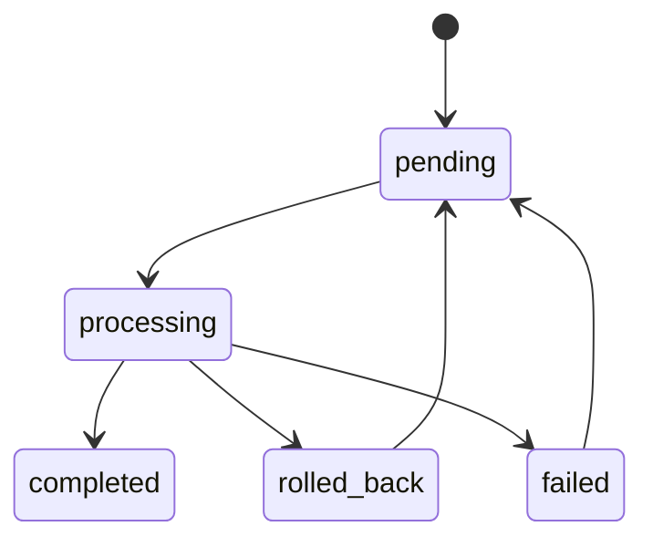

# Ingestion State Machine

## States

The `documents.ingestion_state` field uses these states:

- `pending`  
  Document row exists, but processing has not started.

- `processing`  
  Extraction, chunking, embedding, or vector upsert is in progress.

- `completed`  
  DB chunks and Pinecone vectors are in sync and verification passed.

- `failed`  
  The document could not be ingested and the pipeline could not complete.

- `rolled_back`  
  The pipeline started, created work, then encountered a failure and compensated by rolling back chunk inserts and deleting any created vectors.

## Allowed transitions

## Transition rules

- `pending -> processing`
  - The ingestion job has been accepted and a document record exists.

- `processing -> completed`
  - Text extraction succeeded.
  - Chunks were inserted.
  - Embeddings were generated.
  - Vectors were upserted.
  - Verification passed.

- `processing -> rolled_back`
  - Vector upsert failed, verification failed, or another transactional step failed after partial work.
  - The pipeline removed temporary vectors and rolled back DB chunk work.

- `processing -> failed`
  - The job failed before it could safely enter the transactional chunk/vector phase.
  - The row remains for observability and retry.

## Retry behavior

Retries are checksum-driven.

If the same PDF is uploaded again:
- completed document -> skip
- failed / rolled_back document -> reuse the existing row and retry safely

The checksum plus deterministic chunk ids prevent duplicate vectors across retries.

## Observability fields

The state machine is tracked with:
- `ingestion_state`
- `ingestion_error`
- `ingestion_started_at`
- `ingestion_completed_at`
- `rolled_back_at`
- checksum
- chunk/vector counts in logs and verification output

## Operational interpretation

- `pending` means accepted but not yet worked.
- `processing` means the pipeline is active.
- `completed` means the DB and Pinecone are synchronized.
- `failed` means retry may be needed.
- `rolled_back` means the system cleaned up after a partial failure.
